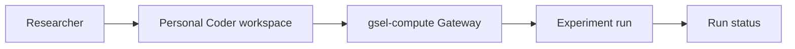

# Research workflow

| Component | Researcher task |
| --- | --- |
| GSEL sign-in | Authenticate with your laboratory account. |
| Coder | Edit code and use Pixi, Claude Code, or Codex through a browser, CLI, or desktop editor. |
| `gsel-compute` Gateway | Submit a project experiment and request resources. |
| Experiment run | Execute the submitted revision and check its state and outputs. |

Start with your [first workspace](../onboarding/first-workspace.md), then
[prepare a project](../projects/pixi.md) and
[submit an experiment](../compute/experiments.md).
