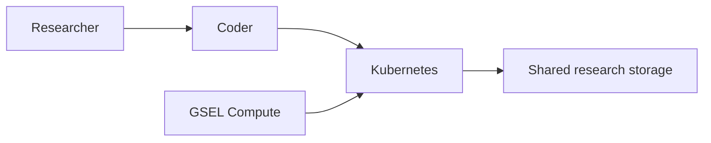

# Public system overview

GSEL research computing is built from a small set of components. This page
describes their roles at a level safe to publish; it omits node names,
network addresses, and other operational detail.

## Components

- **Researcher** — a GSEL member or approved collaborator, signed in through
  the laboratory's Authentik identity (see [GSEL
  sign-in](../onboarding/gsel-sign-in.md)).
- **Coder** — provisions browser- and SSH-accessible development workspaces
  for interactive work. See the [Coder](../coder/create-workspace.md) pages.
- **GSEL Compute** — runs research computing workloads on the cluster. It
  does not yet have a self-service job submission path; use a Coder
  workspace for interactive work in the meantime.
- **Kubernetes** — the cluster orchestration platform that runs Coder
  workspaces and GSEL Compute workloads.
- **Shared research storage** — a storage area available from Coder
  workspaces for shared datasets and results, separate from your private
  workspace storage.
